# Padel discovery surface parity remediation

**Date:** 2026-09-14  
**Benchmark:** Running hub + `/running/shoes` category shell + shared brand/compare/alternatives chrome  
**Scope:** `/padel`, all padel categories, brand hubs, comparisons, alternatives, collections, Finder/database entry points  
**Rule:** Reuse Running visual language — do not invent a new Kitletics system

Screenshot evidence: [`screenshots/surface-parity/`](./screenshots/surface-parity/) + [`capture-manifest.json`](./screenshots/surface-parity/capture-manifest.json)

---

## Verdict

Padel discovery now uses the same **visual hero + decision CTAs + gated product imagery** pattern as Running’s mature surfaces. Category pages are no longer text-only shells. Soft-goods catalogs only list media-verified products (27 shoes / 29 grips in live capture). Hub quick actions now reach Finder, Best, Database, Guides, Collections, and Brands.

**Still not identical to Running shoes:** Running keeps a dedicated `RunningShoesCategoryPage` collage assembler; Padel uses the shared `CategoryPage` upgraded with `CategoryVisualHero` (same visual language, shared template). That is intentional reuse, not a redesign.

---

## Before → after (major templates)

True historical “before” PNGs were not archived in-repo (prior audit environment could not screenshot). **Before** = documented pre-remediation behaviour from `PADEL-RUNNING-PARITY-AUDIT` / discovery UX audit. **After** = live captures on `127.0.0.1:3015` after this pass. **Benchmark** = Running equivalents captured in the same session.

### 1. Sport hub

| | Before | After | Running benchmark |
| --- | --- | --- | --- |
| State | Shared `SportHubPage`; 4 quick actions; soft Best strips could thin | 6 quick actions (Finder, Best, Database, How to choose, Collections, Brands); racket Best strips inline Finder | Mature hub with fit filters + category groups |
| Evidence | Audit: hub MAJOR_PARITY_GAPS | 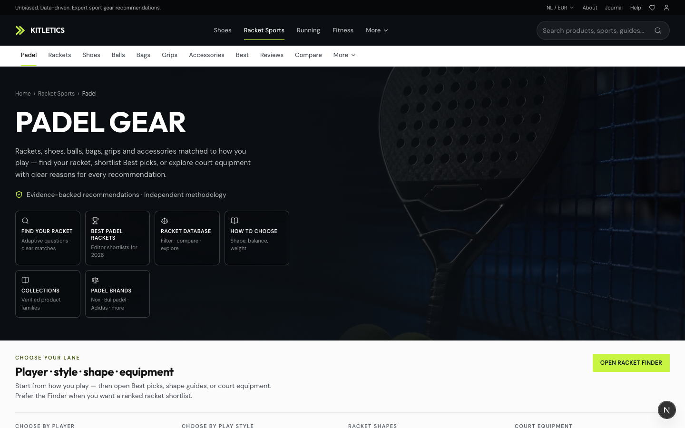 | 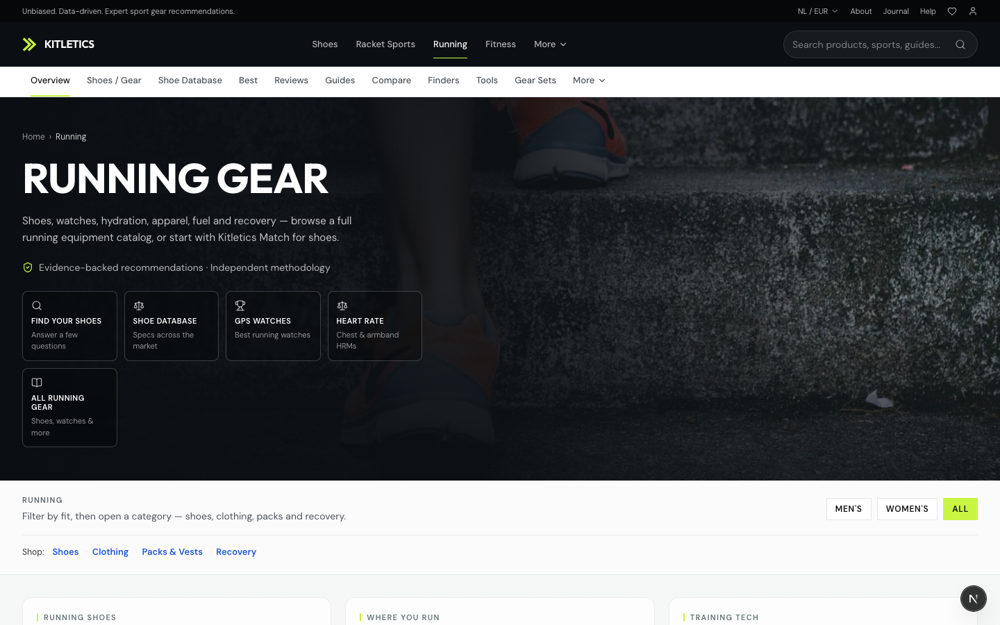 |
| Mobile | — | [`hub-padel-mobile.png`](./screenshots/surface-parity/hub-padel-mobile.png) | [`hub-running-mobile.png`](./screenshots/surface-parity/hub-running-mobile.png) |

### 2. Category — rackets

| | Before | After | Running shoes benchmark |
| --- | --- | --- | --- |
| State | Compact text-only `CategoryPage` hero; no product collage; empty use-case rails | Running-style visual hero + product collage; Find/Best CTAs; shop-by-goal + Best shortlist rails; related categories; filters with real product cards | Dedicated shoes collage hero |
| Evidence | Audit §2.6 / categoryShell gap | 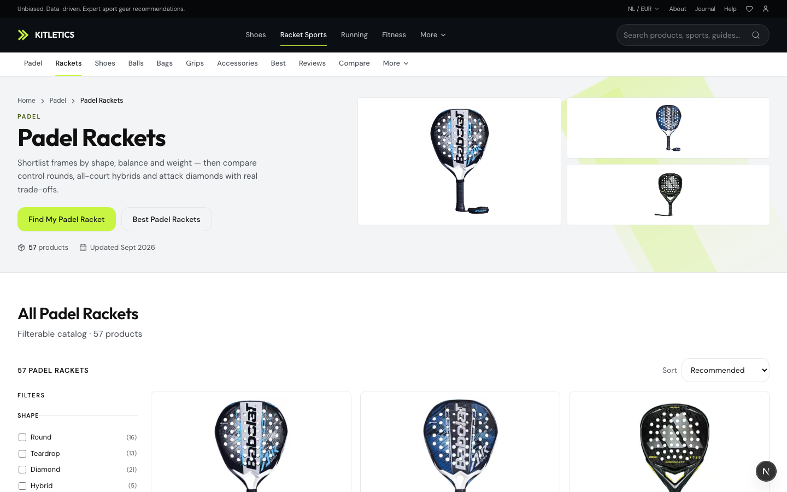 | 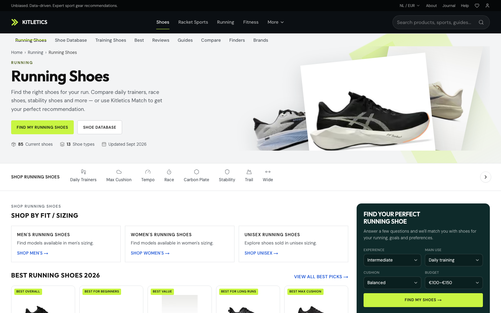 |
| Mobile | — | [`cat-rackets-mobile.png`](./screenshots/surface-parity/cat-rackets-mobile.png) | [`cat-shoes-running-mobile.png`](./screenshots/surface-parity/cat-shoes-running-mobile.png) |

### 3. Category — soft goods (shoes / grips)

| | Before | After |
| --- | --- | --- |
| State | Soft-goods SYSTEMIC_PARITY_FAILURE — thin media, empty discovery knobs, text heroes | Visual heroes + collage from listable heroes; shoes show **27** imaged products + gender fit chips; grips **29** imaged products + grip-type filters; no blank grid tiles (publication + media gate) |
| Shoes | — | 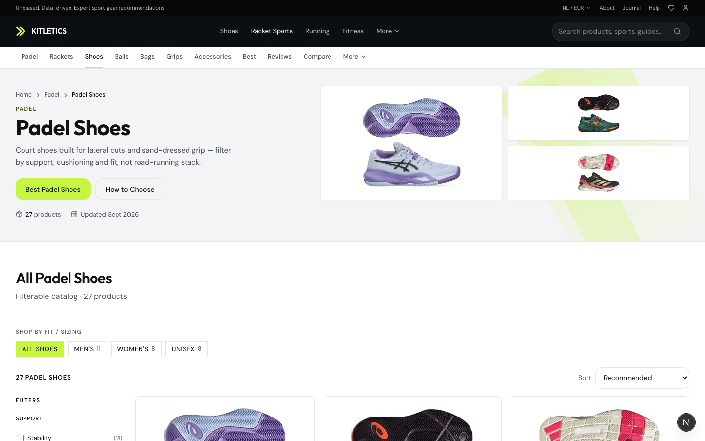 · [`mobile`](./screenshots/surface-parity/cat-shoes-padel-mobile.png) |
| Grips | — | 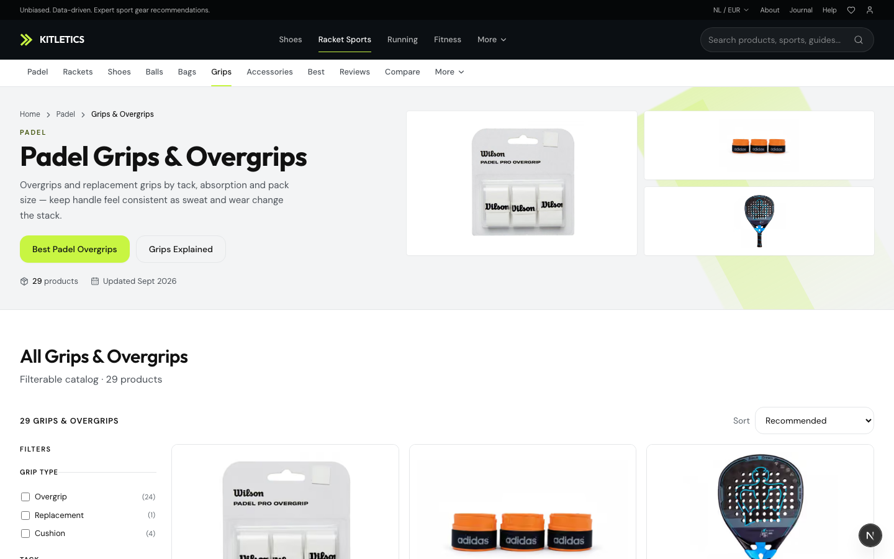 · [`mobile`](./screenshots/surface-parity/cat-grips-mobile.png) |

### 4. Brand hubs

| | Before | After | Running |
| --- | --- | --- | --- |
| State | Shared brand hub; padel configs existed; risk of text-heavy inventories | Still shared chrome; already `canFeatureProduct` gated; padel sport filter entry from hub | Same template |
| Evidence | — | 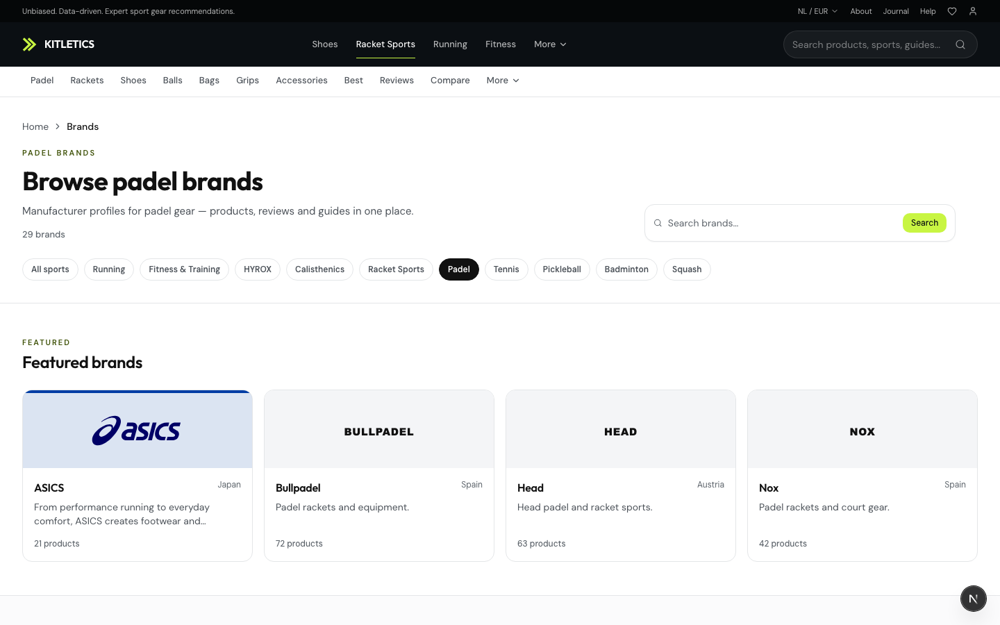 | 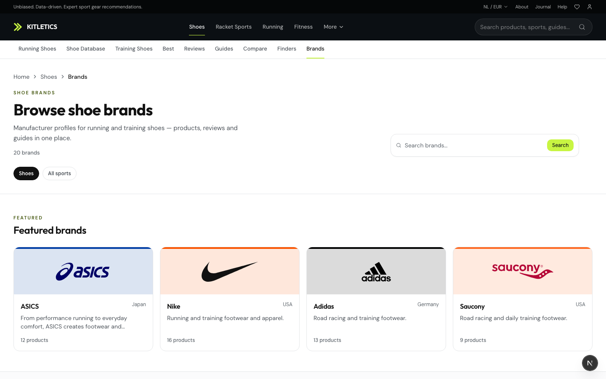 |

### 5. Comparisons

| | Before | After | Running |
| --- | --- | --- | --- |
| State | Shared compare; rails could include media-less alts | Dynamic compare requires primary media on every product; featured comps + compare-page alternatives skip imageless SKUs | Same engine |
| Evidence | — | 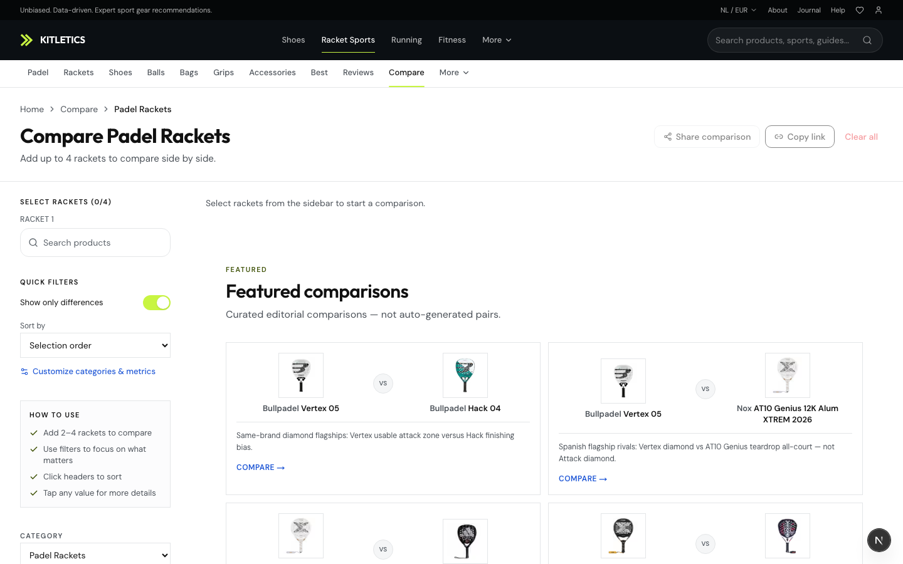 | 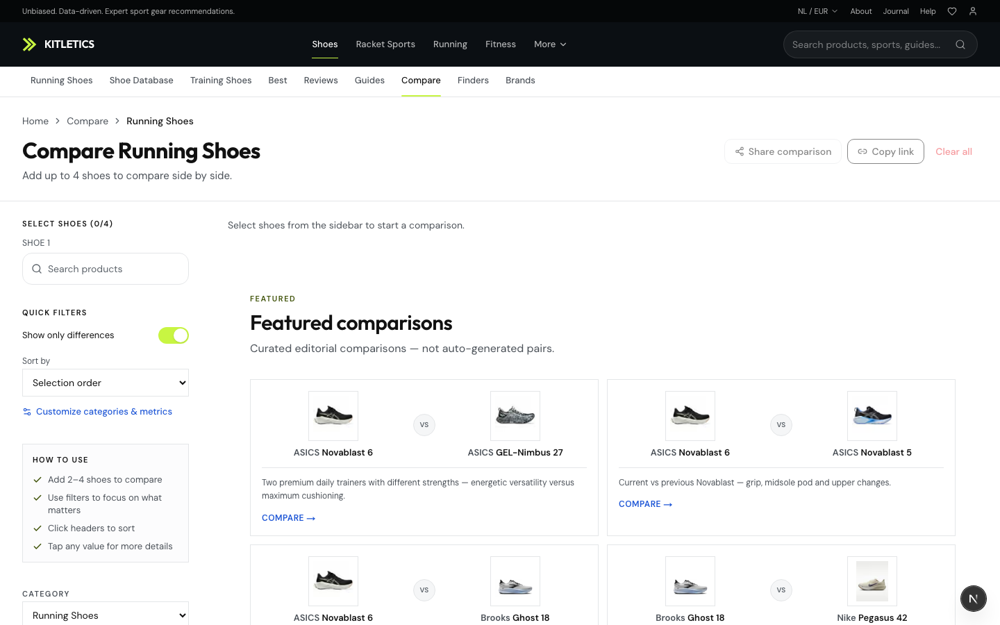 |

### 6. Alternatives

| | Before | After |
| --- | --- | --- |
| State | Could list alternatives without packshots | `getAlternativesPageData` **skips** alternatives without `getPrimaryProductMedia` — choice set is visual |

### 7. Finder / database / collections

| Surface | After evidence |
| --- | --- |
| Finder | 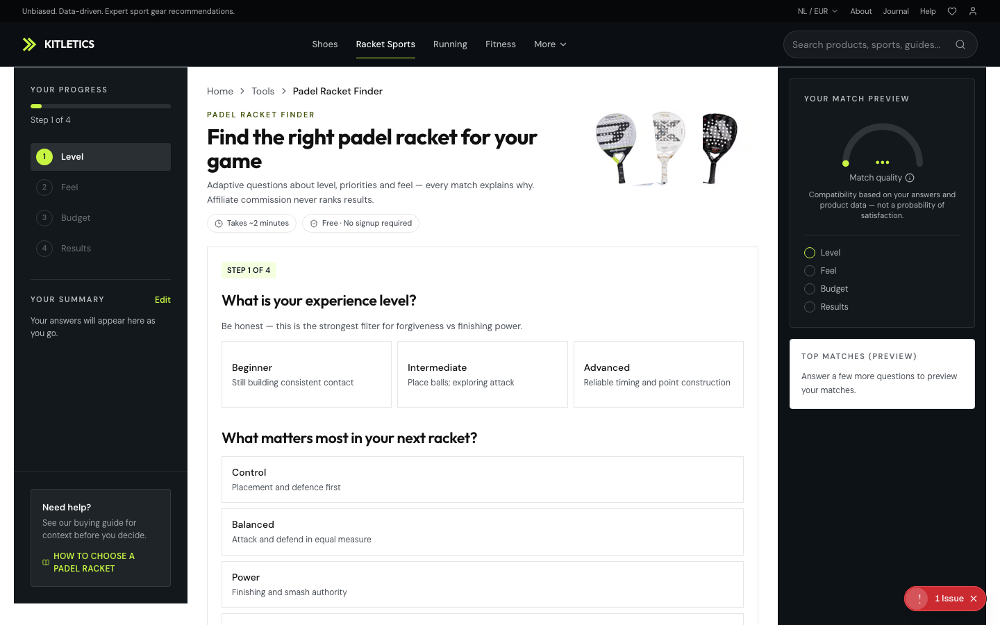 · [`mobile`](./screenshots/surface-parity/finder-padel-mobile.png) |
| Racket database | 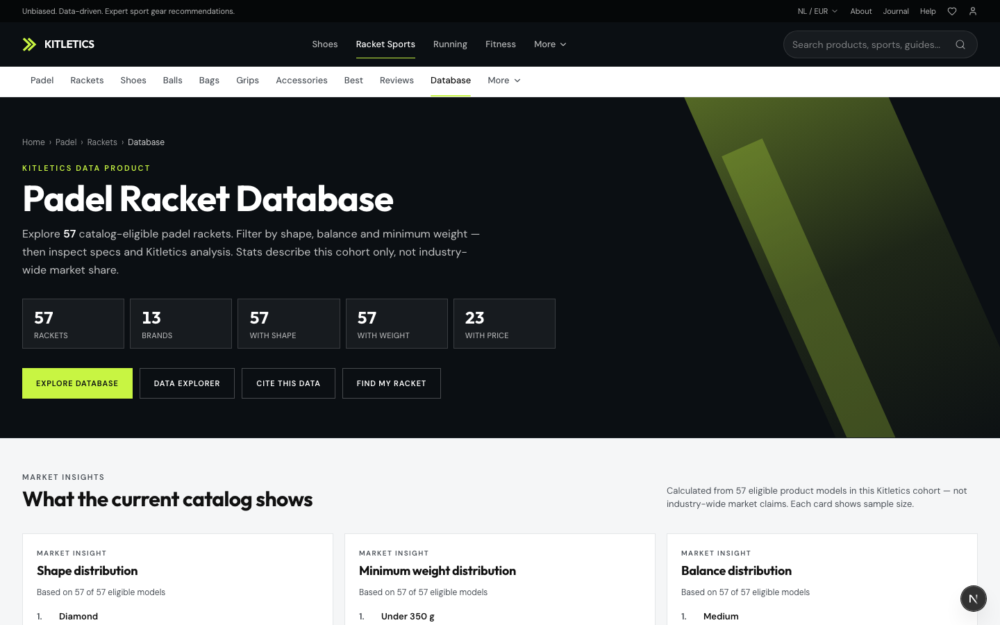 · [`mobile`](./screenshots/surface-parity/db-padel-mobile.png) |
| Collections | 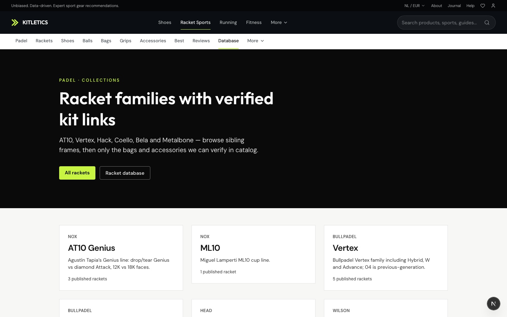 · [`mobile`](./screenshots/surface-parity/collections-mobile.png) |

---

## What changed (code)

### Category visual system
- New `CategoryVisualHero` — Running-shoes visual language (lime diagonal, CTAs, product collage or editorial image)
- `CategoryPage` uses it for all non-shoes-special-case categories (including every padel category)
- Optional `hero.imageSrc` / `relatedCategories` on `ProductCategoryPageConfig`
- Kitletics Picks cards now show product images and drop imageless picks

### Padel category configs (`padel-category-configs.ts`)
- Hero images for rackets / shoes / grips / bags / balls / accessories
- Related category cross-links on every category
- Rackets: goal use cases + Best shortlist rails (`runnerUseCaseHrefs`)
- Shoes: `genderFit` primary filter (was incorrect `fit` key)

### Hub (`padelSportHubConfig`)
- Finder tool slug on beginner/control/power Best strips
- Quick actions: Collections + Brands added

### Media / empty-grid gates
- Alternatives: no imageless alternatives in the ranked set
- Comparisons: imageless products blocked from dynamic compare; imageless alts/featured comps filtered
- Catalog listing already required `canFeatureProduct` / padel media verification — grids that render are image-backed (captured: 57 rackets, 27 shoes, 29 grips)

---

## Mobile

Desktop + mobile viewport captures (390×844) for every major template are in `screenshots/surface-parity/*-mobile.png`. Cards, filters, and heroes stack using the same Running component system (`CatalogInteractive` drawer filters, hub quick-action grid).

---

## Still blocked / residual

1. **Running shoes still has a dedicated page assembler** — padel rackets are visually close via shared hero, but do not get the full shoes collage data pipeline.
2. **No padel use-case URL tree** (`/padel/rackets/control` listings) — Best guides + category chips cover the job; optional follow-up.
3. **Soft-goods long-tail** — unpublished / unverified heroes stay gated (correct); expanding authentic heroes remains a media ops task, not a blank-grid UI task.
4. **Balls / bags / accessories** — configs upgraded; live density depends on verified soft-goods media inventory.
5. **Historical before PNGs** — not available; before column is audit-described. Re-capture if needed from git history checkout.

---

## Counts

| Metric | Value |
| --- | --- |
| Templates screenshot-captured (desktop+mobile) | 13 paths × 2 = **26** PNGs |
| HTTP 200 on all capture targets | Yes (see manifest) |
| Category visual hero | Shared for padel (all 6 categories) |
| Hub quick actions | 4 → **6** |
| Imageless alternatives / dynamic compare | **Blocked** |

---

## Definition of done (this pass)

- [x] Running is the benchmark — shared components reused
- [x] Category pages: visual hero, purpose, imaged cards, filters, Best/guides/compare/brands/related
- [x] No empty visual commerce grids (media + publication gates)
- [x] Comparisons / alternatives require real product imagery
- [x] Brand hubs remain image-gated + category-grouped
- [x] `/padel` hub exposes visual categories + Best + Finder + database + collections + brands
- [x] Mobile captures for major templates
- [x] Report with screenshot evidence paths
